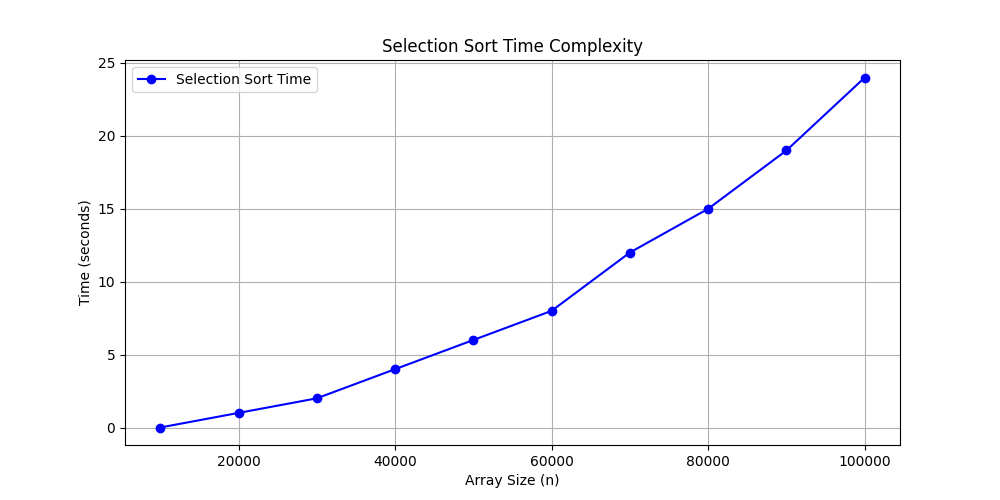
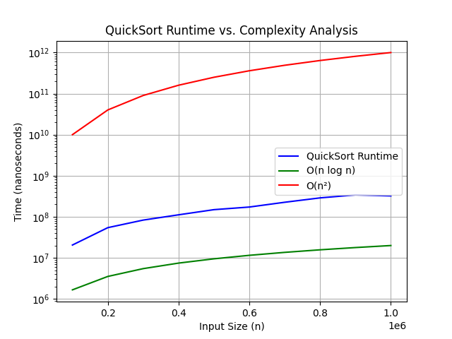
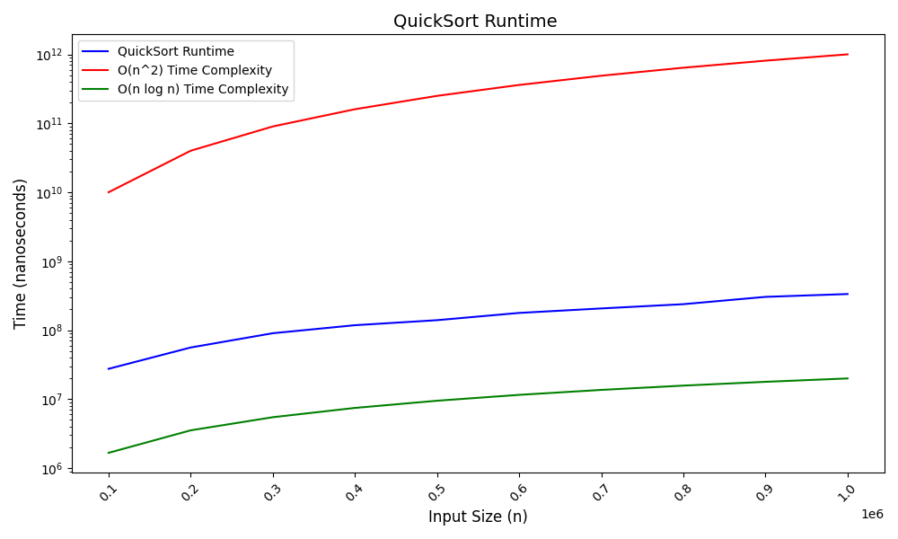
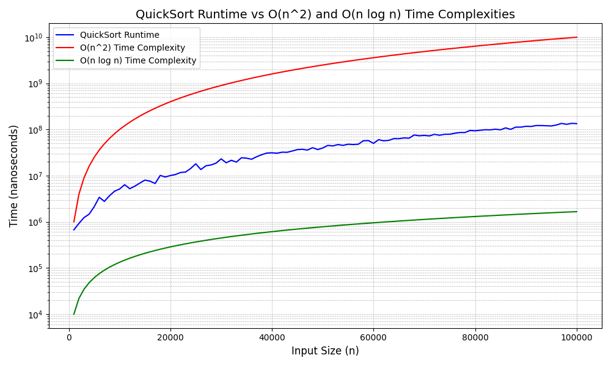
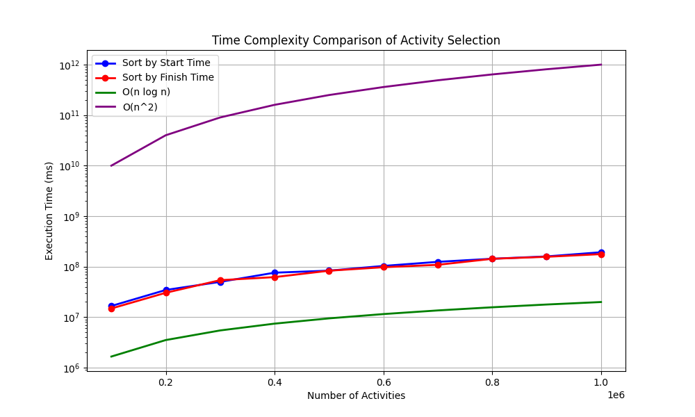
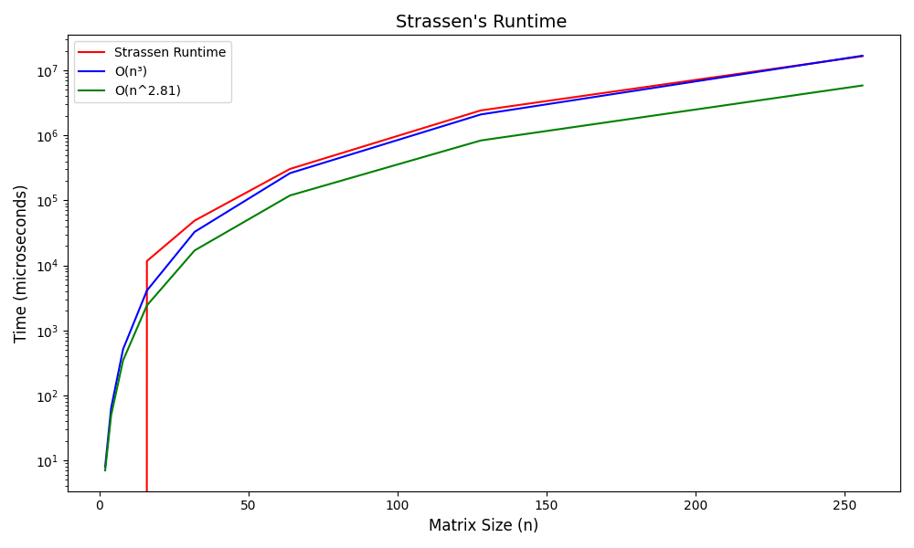
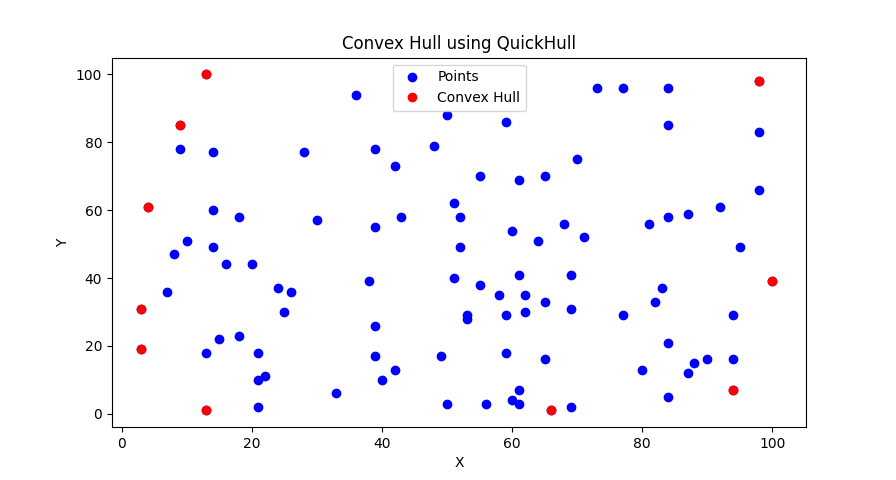
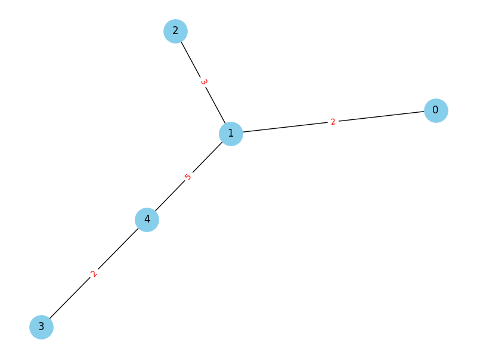
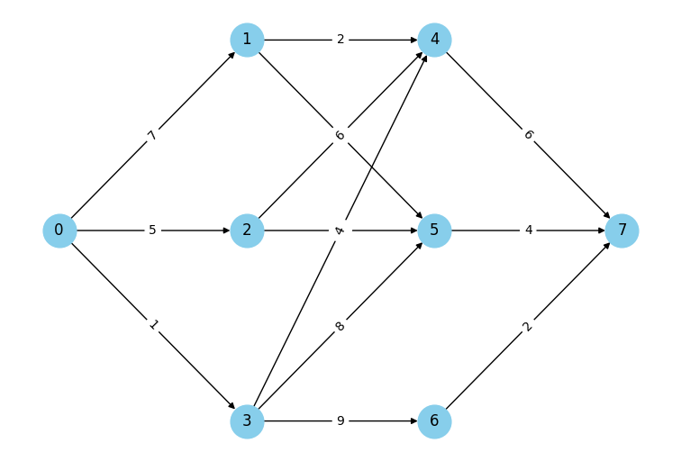
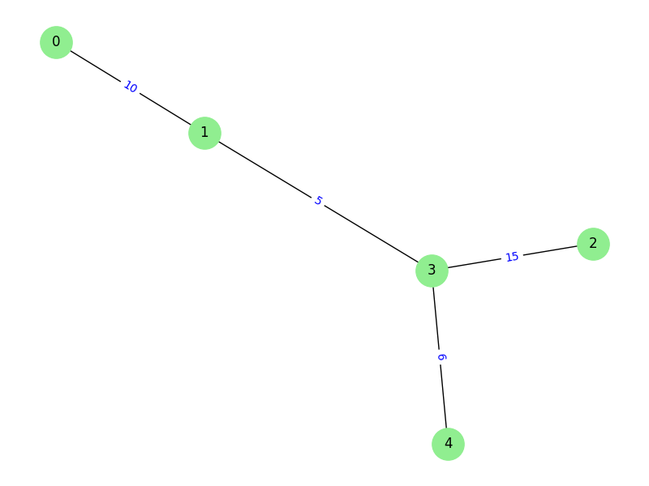

<h1> Analysis and Design of Algorithms </h1>
<!-- 
 -->
    <h3>List of all my ADA programs:</h3>
<!-- 
 -->
    <ol>
    <li><b>Selection Sort Algorithm:</b>  
          <ul>
              <li>Selection Sort is a simple sorting algorithm that repeatedly selects the smallest (or largest) element from the unsorted portion and swaps it with the first unsorted element.
              </li>
              <li>In each iteration of this algorithm, we find the smallest portion in the unsorted portion of array.</li>
              <li>Swap this smallest element with the first element of the unsorted portion.</li>
              <li>Then, we shift the boundary of loop iteration one step forward (2 to n-1)...</li>
              <li>Time complexity is O(n2) for best and worst case scenarios.</li> 
                
          </ul>
      </li> 
      <li><b>QuickSort Algorithm:</b>  
          <ul>
              <li>This is an efficient sorting algorithm that works well for larger input values.
              </li>
              <li>In this algorithm, we select a pivot element and then partition the entire array  
                  around that pivot to ensure that elements greater than the pivot are to the right  of it and smaller elements are to the left of it. </li> 
                    
              <li>
                  Inherently, a recursion stack is used to perform sorting of the elements according to the pivot element.  
                  But, that results in a larger time complexity of the O(n^2) which is highly undesirable...  
                  Instead, we prefer to the use the iterative quicksort using a user-defined stack that significantly  
                  decreases the time complexity (near O(n log n))... 
                   
                    
              </li>
          </ul>
      </li>  
      <li>
          <b>Peak finding:</b>  
          <ul>
              <li>
                  In 1D array, it is simple to find the peak element by just following the approach  
                  of comparing each element with its immediate left and right elements and if it is greater than both of them,  
                  that is the Peak.</li>
              <li>In a 2D array, we implement the same approach but with a binary search twist.</li>
              <li>Time complexity of O(n) for finding peak in 1D array but it can be optimized to O(log n) using binary search approach.
              </li>
              <li>Time complexity of O(nxm) for finding peak in 2D array but it can be optimized to O(nxlog m) using binary search approach.</li>
          </ul>
      </li>  
      <li>
          <b>Magic Square</b>  
          <ul>
              <li>(Odd Size)Sum of all rows, columns and diagonals is equal... Creates a square matrix where the sum of all  columns, rows and diagonals is equal.</li>
              <li>Follows a set pattern in where the numbers increase in a diagonal upwards to the left and goes down  one when number is a multiple of the size...</li>
              <li>Time complexity of O(n2) for finding magic square.</li>
          </ul>
      </li>   
        <li>
          <b>Fractional Knapsack</b>  
          <ul>
              <li>Problem involving the calculation of maximum profit that can be derived from a given set of values</li>
              <li>We sort the array according to the criterion we need(here we sort 3 time, according to profit, weight and  ratio of profit/weight) and then pick the items in non-increasing manner</li>
              <li>In this problem, we can include fractional parts of an item as well incase an item cannot be included  completely in the knapsack...</li>
              <li>Suppose, we have the max capacity of knapsack M and profits (Pi) and weights (Wi)... Then, we aim to maximize the (PiXi) subject to the constraint that (WiXi); where X is a flag array that tells the amount of item included...</li>
              <li>The total Time complexity for this probelm is O(n log n) as the sorting takes (n log n) time whereas selecting the items takes O(n) time. So dominant is O(n log n).</li>
               
                    
          </ul>
      </li>  
        <li>
          <b>Activity Selection</b>  
          <ul>
              <li>We want to ensure that maximum number of jobs(or activities) are scheduled/completed within a given period of time...</li>
              <li>The goal is to maximize the number of jobs(or CPU usage) by ensuring highest amount of jobs that  can be completed without any overlap.</li>
              <li>In this problem, sort the activities by their start time and then by their finish times to calculate which  method leads to max number of activities that get completed without any overlap.
              </li>
              <li>The total Time complexity for this problem is O(n log n) as the sorting by finish times takes O(n log n) time whereas selecting the items takes O(n) time. So dominant is O(n log n).</li>
               
                    
          </ul>
      </li>  
        <li>
          <b>Matrix Multiplication</b>  
          <ul>
                  <li>Conventional Method:  We use 3 for loops to calculate the elements of the resultant matrix which gives us a 
                      time complexity of O(n3)...</li>
                  <li>Divide And Conquer:   We divide the larger matrices into smaller matrices by halving them effectively from 
                      the order of n to n/2 each.
                  Still, using recursion we get Time complexity of O(n3).</li>
                  <li>Strassen:   Now, we modify our DnC code to replace 8 matrix multiplications to 7 while increasing the number of matrix additions and sutractions... This gives us Time complexity = O(n2.81).
                  </li>
                    
          </ul>
      </li>  
        <li>
          <b>Convex Hull of a Polygon</b>  
          <ul>
              <li>Quick Hull:  
              We use an algorithm similar to quicksort in the sense that, we divide the given set of points into set of triangles and  we try to find that triangles which have maximum possible area coz they will be the ones forming the convex hull...</li>
              <ol type="A">
                  <li>We find the leftmost and rightmost points (points with max and min x-coordinate) so as to divide the set of points  into 2 portions.</li>
                  <li>We calculate the perpendicular distance of a point from a line which will help us in finding the max area triangle.</li>  
                  <li>We determine if a point is on the left side of a line coz only then will it be included in the HULL...</li>
                  <li>The Worst case Time complexity for this problem is O(n2) whereas average case complexity is O(n log n).</li>                  
              </ol>
                
          </ul>
      </li>  
         <li>
          <b>Prim's Algorithm</b>  
          <ul>
              <li>A greedy algorithm that is used to calculate the minimum cost spanning tree for a given graph.</li>
              <li>A spanning tree is a subgraph of a connected, undirected graph that:  
                  <ol>
                      <li>Includes all the vertices (nodes) of the original graph.</li>
                      <li>Is a tree itself, meaning it's connected and has no cycles (loops).</li>
                      <li>Has exactly n-1 edges, where n is the number of vertices.</li>
                  </ol>
              <li>First of all, we select a minimum weight edge to start building the MST. Then, we select the vertices (i,j)  such that i is in MST and j is not in MST.</li>
              <li>Then; we also initialize a near variable that keeps track of the vertices(in MST) nearest to current vertex.  We continue adding the edges using this near variable.</li>
              <li>Time complexity of this algo -> O(n2)</li>
                
          </ul>
      </li>  
        <li>
          <b>Dijkstra's Algorithm</b>  
          <ul>
              <li>A greedy algorithm that is used to calculate the shortest path / minimum cost path from a (source) vertex  to all the other vertices of the graph.</li>
              <li>This is also known as Single source shortest path algorithm as it calculates shortest path from one source  to all the other vertices.</li>
              <li>First we intialize the shortest path equal to the values given in the adjacency matrix and then; later we see  if we are able to come up with a shorter path by going from source to that                     particular vertex via some vertices  that are already in SptSet(already shortest path calculate ho chuka hai)...</li>
              <li>Time complexity of this algo -> O(n2)</li>
          </ul>
      </li>  
        <li>
          <b>Multi-Stage Graphs</b>  
          <ul>
              <li>An important concept in Dynamic Programming</li>
              <li>A directed, weighted graph in which the vertices are divided into different disjoint sets (stages) such that an  edge exists between Sx to Sx+1 and no edge between vertices of same stage.                  </li>
              <li>Stages -> S1, S2 ... Sk such that a stage Si exists where 1<= i <= k and  number of vertices in S1(source) = number of vertices in Sk(sink)</li>
              <li>In this problem; we aim to find the shortest path a source to a sink using the above stated property of MSGs...</li>
                <li>Time complexity of this algo -> O(n2)</li>
                  
          </ul>
      </li>  
          <li>
          <b>All Pair Shortest Paths</b>  
          <ul>
              <li>An important concept in Dynamic Programming in which we are to find shortest path from each vertex to all  the other vertices.</li>
              <li>Floyd-Warshall algorithm: Solution to this problem that involves storing the shortest paths of previous vertices  in the form of a nxn matrix.</li> 
              <li> Then; to calculate the shortest path from the current vertex, we use those previously calculated results.</li>
              <li>Firstly; we consider direct paths/edges from vertex i to j and then try to find a shorter path from i to any intermediate vertex k and from k to j...</li>
              <li>If we get a shorter path, then we update the matrix and the shortest path between 2 vertices; else continue.</li>
                <li>Time complexity of this algo -> O(n3)</li>
          </ul>
      </li>  
           <li>
          <b>Cosine Similarity</b>  
          <ul>
              <li>Cosine Similarity is a measure of similarity between two vectors based on the cosine of the angle between them.  
               It is widely used in text analysis to compare the similarity of two documents.
              </li>
              <li>We use the concept of dot product to calculate the cosine of the angle between 2 text files.  The result ranges from 0 to 1: 
                1 → Documents are identical. 
                0 → Documents are completely different. 
                Between 0 and 1 → Some level of similarity.</li> 
          </ul>
      </li>  
        <li>
          <b>Kruskal's Algorithm</b>  
          <ul>
              <li>A greedy algorithm that is used to calculate the minimum cost spanning tree for a given graph.</li>
              <li>Initially, we are given a set of edges that we atore in a min-heap to sort them in increasing order  with the minimum weight edge at the top.</li>
              <li>We devise 2 functions: Find(x) that returns the root of the tree to whcih a vertex x belongs to and,  
              Union(x,y) that makes one vertex the parent of the other.</li>
              <li>We include the edges(not yet visited) in the MST one by one acc. to their edge weights only if their  inclusion does not result in formation of a cycle i.e for an edge u,v; Find(u) must not be equal to Find(v).  Then, we perform their union and include them in the MST...</li>
              <li>The Time complexity is O(E x log V) as selecting edges from the heap takes O(E x log E) time whereas, total time for Union-Find operation takes O(E x log V) time.</li>
                
          </ul>
      </li>  
      <li>
          <b>Matrix Chain Multiplication:</b>  
          <ul>
              <li>An important problem in dynamic programming that focuses on optimizing the number of actual scalar  
              multiplications required to successfully multiply a given set of matrices.</li>
              <li>In this, we are given an array with n elements (dimensions of matrices) which basically form n-1 matrices.</li>
              <li>We then use recursive formula to determine the minimum number of multiplications required to  
              multiply all the matrices along with the order in which the parantheses should be placed so that,  we can optimize this task.</li>
              <li>Time complexity of this algo -> O(n3)</li>
          </ul>
      </li> 
      <li>
          <b>0/1 Knapsack:</b>  
          <ul>
              <li>An important problem in dynamic programming that is similar to fractional Knpasack problem discussed using the Greedy Approach.</li>
              <li>In this, we either fully include an item in the knapsack (marking 1 for it in the inclusion/flag array) or completely exclude it (marking 0 for it in the flag array).</li>
              <li>We use the Merge-Purge method here to devise a solution to this problem. Merge function adds new state i.e. a new {weight, value} pair to the existing set whenever a new item {wi, vi} is considered. After merging new weight-value pairs, some states might be dominated by others. The Purge function removes these dominated states to keep only the most optimal ones.</li>
          </ul>
      </li> 
    </ol>
