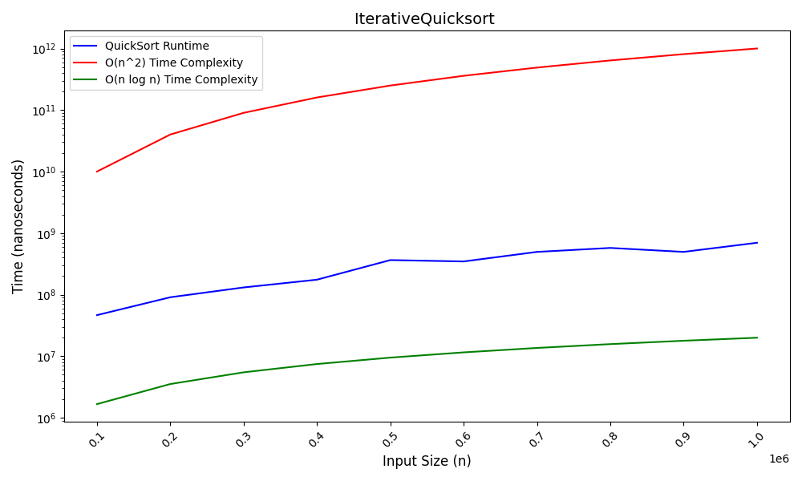

<h1> Analysis and Design of Algorithms </h1>
<!-- 
 -->
    <h3>List of all my ADA programs:</h3>
<!-- 
 -->
    <ol>
      <li><b>QuickSort Algorithm:</b>  
          <ul>
              <li>This is an efficient sorting algorithm that wroks well for larger input values.
              </li>
              <li>In this algorithm, we select a pivot element and then partition the entire array 
                  around that pivot   to ensure that elements greater than the pivot are to the right of it and smaller elements are to the left of it. </li> 
                    
              <li>
                  Inherently, a recursion stack is used to perform sorting of the elements according to the pivot element.  
                  But, that results in a larger time complexity of the O(n^2) which is highly undesirable...  
                  Instead, we prefer to the use the iterative quicksort using a user-defined stack that significantly  
                  decreases the time complexity (near O(n log n))... 
                   
                    
              </li>
          </ul>
      </li>  
      <li>
          <b>Peak finding:</b>  
          <ul>
              <li>
                  In 1D array, it is simple to find the peak element by just following the approach  
                  of comparing each element with its immediate left and right elements and if it is greater than both of them,  
                  that is the Peak :D
              </li>
              <li>
                  In a 2D array, we implement the same approach but with a binary search twist.
              </li>
          </ul>
      </li>  
      <li>
          <b></b>
      </li>  
    </ol>
